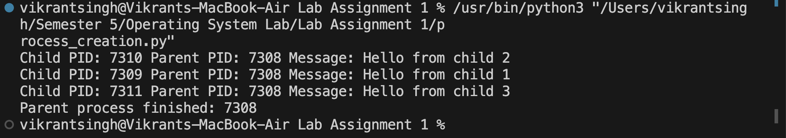
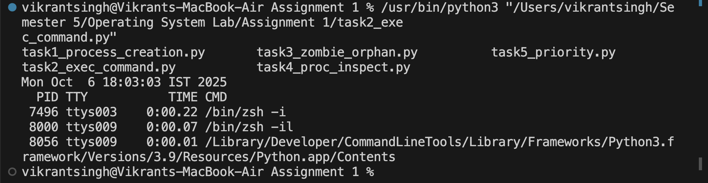
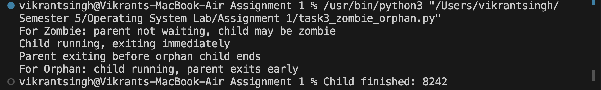
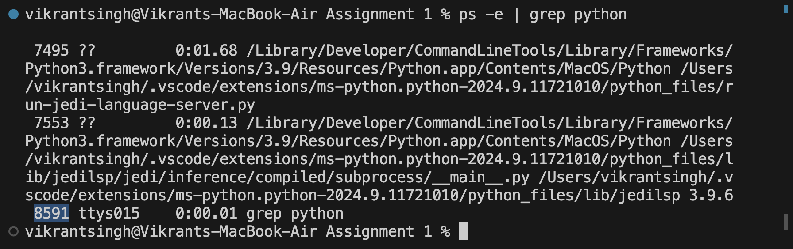
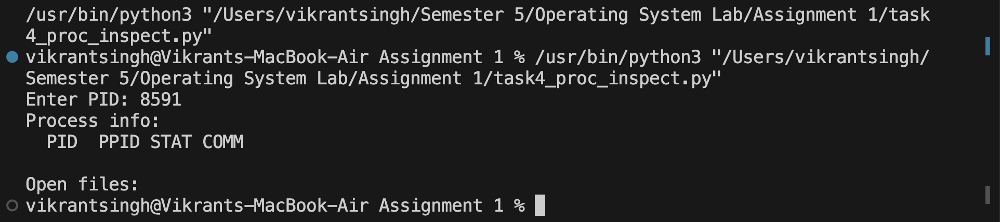
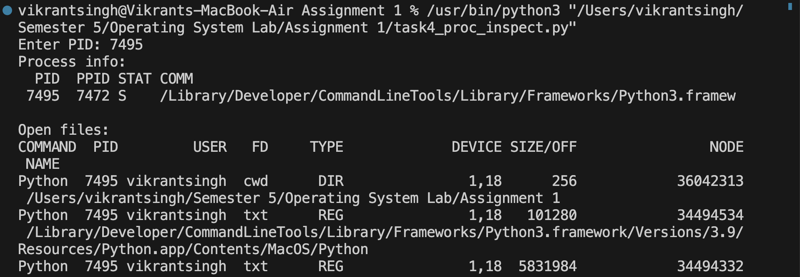
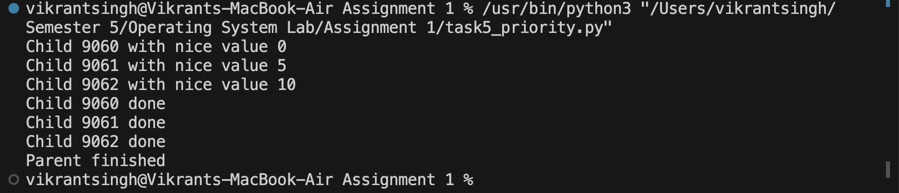

# 📂 Outputs  

---

## 🔹 Task 1: Process Creation Utility  
Output showing child and parent process details.  

  

---

## 🔹 Task 2: Command Execution Using exec()  
Output of executing Linux commands (`ls`, `date`, `ps`) from child processes.  

  

---

## 🔹 Task 3: Zombie & Orphan Processes  
Output demonstrating zombie and orphan process states.  

  

---

## 🔹 Task 4: Inspecting Process Info (Mac)  
**Step 1:** Finding the PID of a running process.  

  

**Step 2:** Showing process info for PID 8591  

  

**Step 3:** Showing process info for PID 7472  

  

---

## 🔹 Task 5: Process Prioritization  
Output showing different execution orders due to varying nice values.  

  

---

📌 *Note: All screenshots are taken from actual runs on a Mac/Linux environment. For Task 4 on Mac, `ps -p <PID>` shows process info and `lsof -p <PID>` shows open files.*
